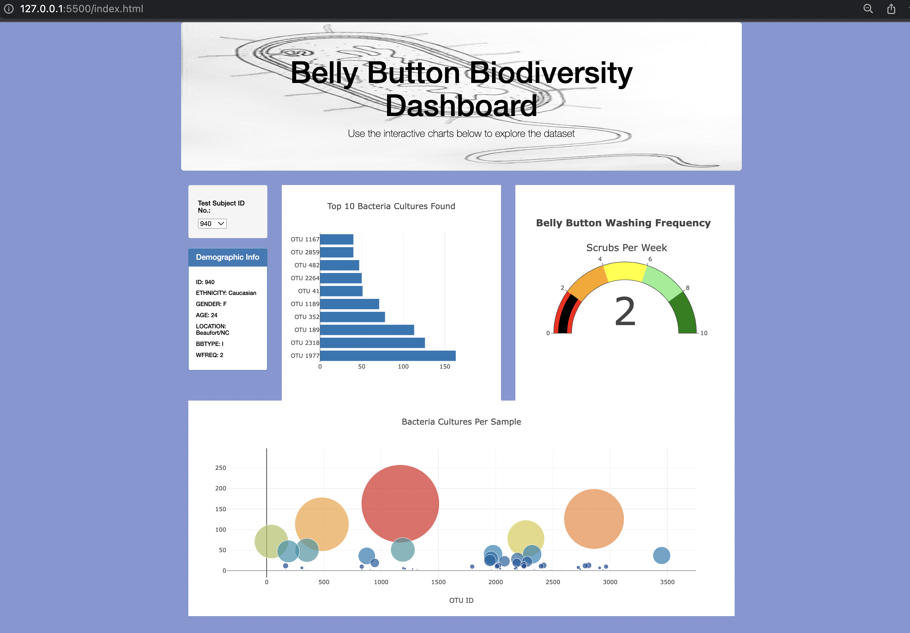

**Bellybutton Challenge**

# Background
Volunteers should be able to identify the top 10 bacterial species in their belly buttons. 

# Dashboard

# Git Pages
  
[Click Here to View Dashboard in Git Pages](https://crdhilep.github.io/plotly_deployment/)
